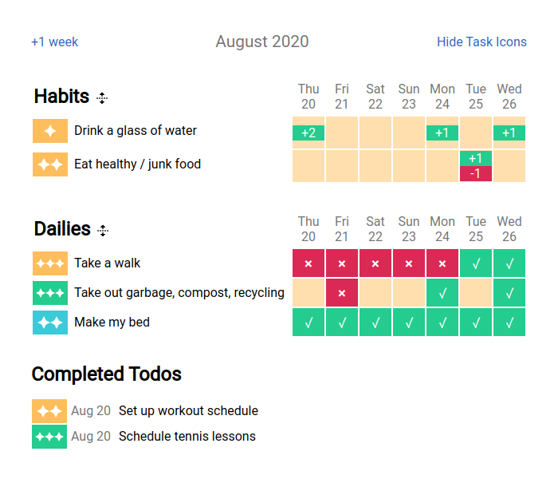

# Habitica History Tool

Displays a history of your Habits, Dailies and Todos in Habitica.

Try it out locally:

```
npm start
```



Inspired by the [Data Display Tool](https://oldgods.net/habitrpg/habitrpg_user_data_display.html).
